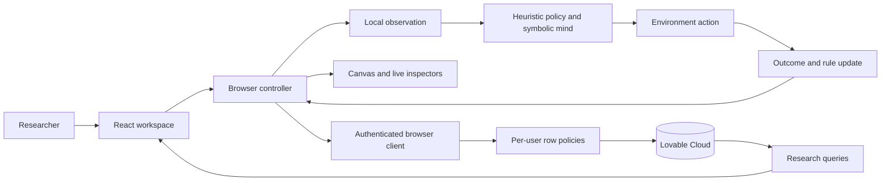

# Genesis

### Artificial Civilization & World Model Lab

A browser-based research sandbox where symbolic agents explore a 2D world, test actions, record outcomes, and build a predictive rule store. Inspect learning histories, observe collective behavior, and compare controlled simulation runs.

[Open the app](https://image-to-interactive-innovator.lovable.app) · [Architecture](docs/ARCHITECTURE.md) · [Setup](docs/SETUP.md) · [Contributing](CONTRIBUTING.md)


> **Research prototype—not an LLM platform or official benchmark.** Agents use a built-in heuristic policy and symbolic memory. Results come from actual simulation activity, not external AI responses. The policy explicitly proposes wood + stone as a candidate recipe; outcomes are learned through interaction. This is not unconstrained discovery of arbitrary recipes.

## Contents

- [Capabilities](#capabilities)
- [Screenshots](#screenshots)
- [System overview](#system-overview)
- [Quick start](#quick-start)
- [First exploration](#first-exploration)
- [Repository map](#repository-map)
- [Research limitations](#research-limitations)
- [Development and GitHub](#development-and-github)

## Capabilities

| Workspace | Implemented behavior |
| --- | --- |
| **World** | Seeded terrain, resources, day/night, play/pause/step, speed, reset, new worlds, pan/zoom, tile/agent inspection |
| **Agents** | Energy, objectives, inventory, coverage, rules, confidence, evidence, recent predicted-versus-actual outcomes |
| **World Model** | Symbolic hypotheses, confirmed/incorrect rules, recent prediction chart, researcher ground-truth view |
| **Civilization** | Resource distribution, role labels, communication, shared knowledge, exchange counters, event timeline |
| **Experiments** | Independent runs with seed, population, step budget, hypothesis, notes, communication/sharing toggles, two-run comparison |
| **Analytics** | Charts computed from stored experiment summaries and knowledge; no fabricated chart series |
| **Settings** | JSON/CSV exports and future provider preferences; preferences do not connect a model |

Accounts and persisted records use Lovable Cloud with per-user row policies. Simulation calculations execute in the browser.

## Screenshots

Actual captures of a running Genesis session, not mockups. Values are observed activity, not performance claims. Account details are excluded. The world image is a close-up; the world-model image shows the upper portion of its page.

### Agent inspection


### Symbolic world model


### Collective behavior


## System overview



The environment defines outcomes; agents accumulate evidence; the controller schedules steps and saves state; the UI displays recorded activity. Ground truth is omitted from agent observations, but bundled client-side for environment execution and researcher inspection. It is not secret from a person inspecting the browser.

[Architecture](docs/ARCHITECTURE.md) covers modules, tick sequence, data relationships, metric definitions, persistence, and trust boundaries.

## Quick start

Use current Bun and Node.js 22.12+ or a compatible newer release. Clone this repository, then run from its root:

```sh
bun install --frozen-lockfile
cp .env.example .env.local
# Populate the two public connection values in .env.local.
bun run dev
```

Open the address printed by Vite. The Lovable preview uses port 8080; a standalone checkout may use another port.

**Backend setup is required:** a code checkout does not include accounts, database records, or hosted auth settings. Configure public connection values, apply the schema to an appropriate backend, and authorize local sign-in destinations. See [Setup](docs/SETUP.md). Never put an administrative key into browser configuration.

## First exploration

1. Sign in and open **World**; a new account creates a new world.
2. Press **Play**, or advance ticks with **Step**.
3. Watch gathering and action tests. Tool creation depends on reaching wood and stone; timing varies.
4. Pause, open **Agents**, and select an agent to inspect its rules and recent outcomes.
5. Open **World Model** to compare learned evidence with the separate researcher view.
6. Create an **Experiment**, then repeat with a changed configuration and compare saved summaries.

Keep the tab open during execution. Stored snapshots are not a background job. Reset deletes/replaces the live world's agent/history records; export anything you want to keep first.

## Repository map

```text
src/
  routes/                      TanStack pages and account-gated layout
  components/WorldCanvas.tsx   Interactive 2D rendering
  lib/genesis/
    world.ts                   State, observations, environment transitions
    agent.ts                   Heuristic decisions, predictions, rule updates
    controller.ts              Ticks, offline runs, persistence, downloads
    session.ts                 In-tab singleton and snapshot loading
    queries.ts                 Research-data queries
    rng.ts                     Seeded random helpers
  integrations/                Generated auth and backend clients
  styles.css                   Dark research theme and semantic tokens
  test/                        Test setup and routing smoke test
 drizzle/migrations/          Application schema history
 docs/                        Architecture, setup, actual screenshots
```

**Stack:** React 19, TypeScript, TanStack Start/Router/Query, Vite, Tailwind CSS 4, shadcn/ui & Radix, HTML Canvas, Recharts, Lovable Cloud, PostgreSQL row-level security.

## Research limitations

- **No external models:** provider fields are preferences, not model adapters. No neural world model or official ARC-AGI scoring is implemented.
- **Hand-coded priors:** survival, exploration, obstacle predictions, and the wood-plus-stone candidate are partly programmed. An empty rule store does not mean no prior knowledge.
- **Not exact replay:** terrain is seeded, but random agent UUIDs affect action RNG. Matching seeds do not guarantee identical trajectories.
- **Heuristic accuracy:** error uses string matching and success, not full next-state evaluation. A displayed 100% does not establish causal understanding. Resource depletion can produce noisy rule confidence.
- **Windowed metrics:** recent actions are capped at 300 and in-memory events at 200. Experiment accuracy/discovery-event counts use these windows, not necessarily the whole run.
- **Client-authoritative:** row policies isolate records, but do not certify uploaded simulation results. A modified client can submit altered records.
- **Non-atomic persistence:** snapshots, experiences, knowledge, and agents save separately. Failures are not comprehensively retried; abrupt closure can lose progress.
- **Single active tab recommended:** no multi-tab locking. The singleton is not explicitly invalidated on account change; reload before switching accounts.
- **Early collective behavior:** messages, transfers, and shared rules exist; institutions, learned social strategy, and open-ended economies do not.

## Development and GitHub

```sh
bun run test     # Current routing smoke test—not comprehensive engine coverage
bun run lint
bun run build
```

Connect through Lovable chat **+ → GitHub → Connect project**, authorize GitHub, choose your account/organization, and create the repository. Lovable then synchronizes source, docs, and images automatically. Sync does not transfer backend records, provider setup, or private secrets; it also does not publish a new app version.

Avoid rewriting published history on a connected branch. See [Contributing](CONTRIBUTING.md) and [Security](SECURITY.md).

### Future work—not implemented

Model adapters; unbiased recipe candidates; stable seeded agent identities; structured outcome evaluation; engine/access tests; robust persistence and account lifecycle; trusted server execution and durable background jobs.

### License

No open-source license has been selected. Public GitHub visibility alone is not an open-source license; the owner should choose terms before inviting reuse.
