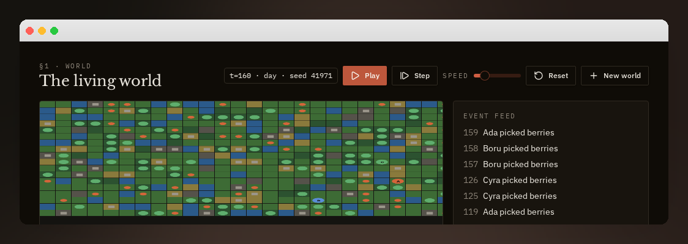
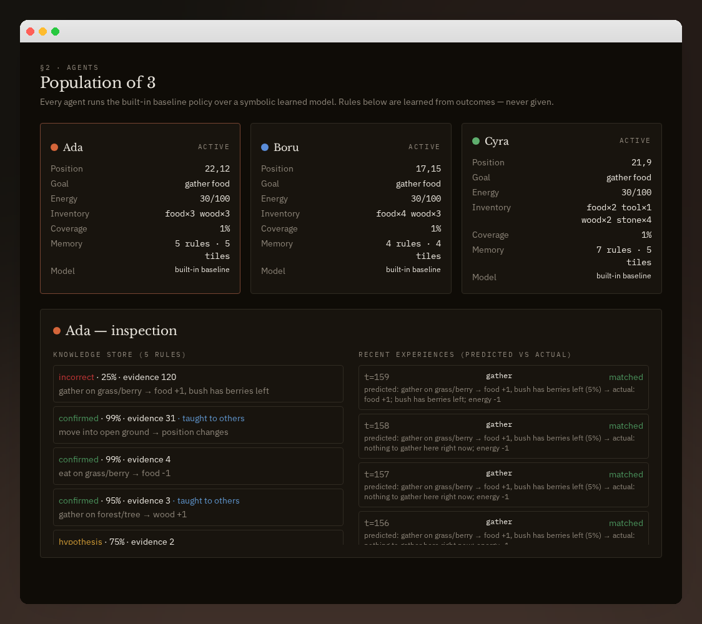
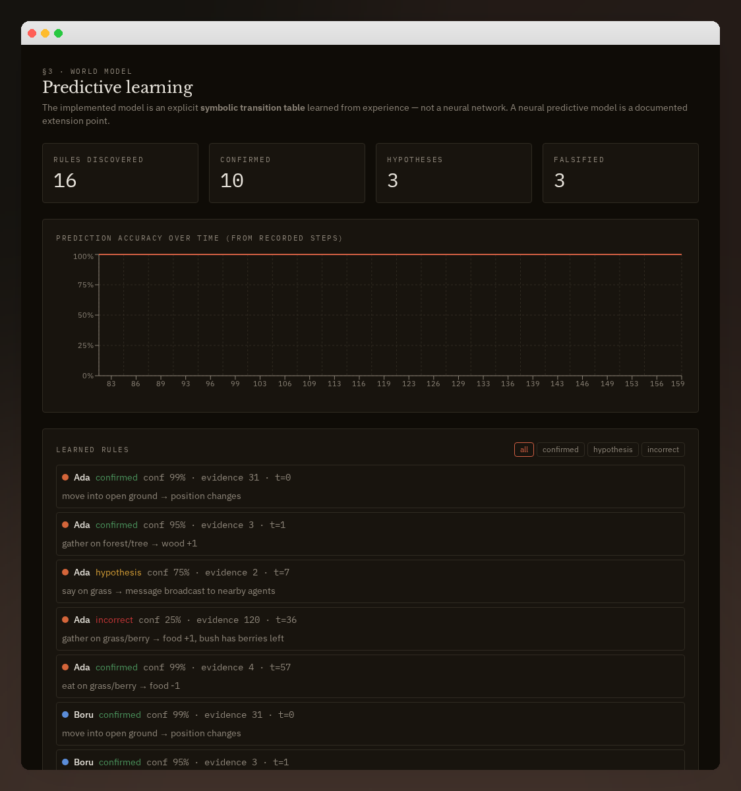
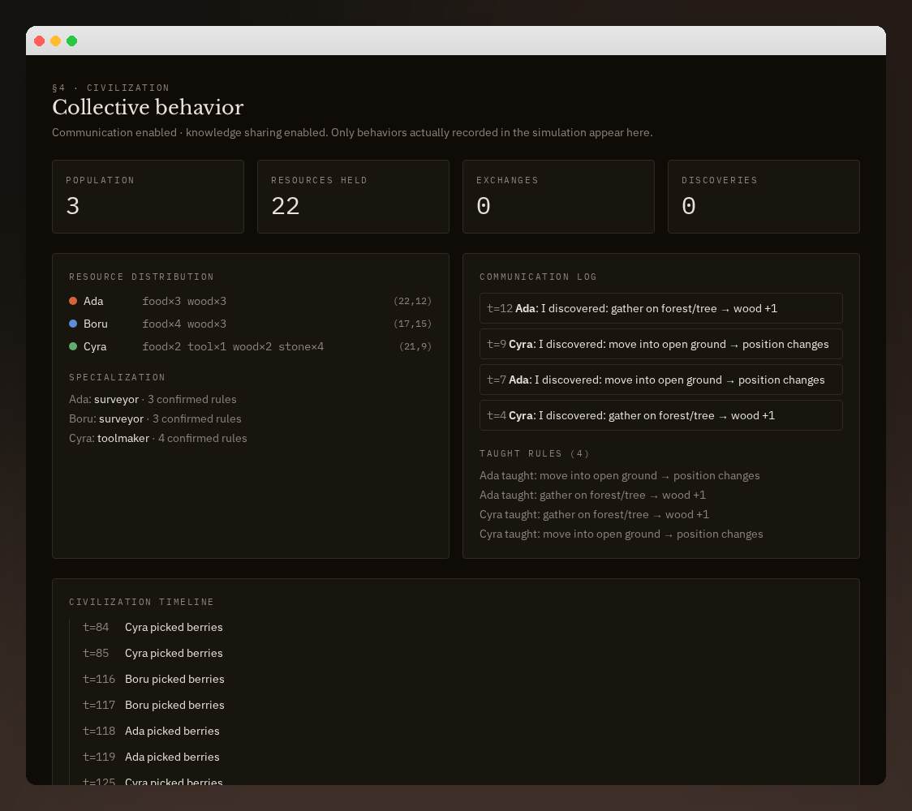
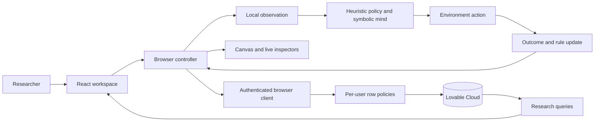

<div align="center">

# Genesis

### Artificial Civilization & World Model Lab

**Explore a world. Record its transitions. Inspect what the agents learn.**

[](LICENSE)


[Live app](https://image-to-interactive-innovator.lovable.app) · [Documentation](docs/README.md) · [Architecture](docs/ARCHITECTURE.md) · [Getting started](docs/SETUP.md)

</div>

A browser-based research sandbox where symbolic agents explore a 2D world, test actions, record outcomes, and build a predictive rule store. Inspect learning histories, observe collective behavior, and compare controlled simulation runs.

[Simulation reference](docs/SIMULATION_REFERENCE.md) · [Research protocol](docs/RESEARCH_PROTOCOL.md) · [Contributing](CONTRIBUTING.md) · [Security](SECURITY.md)



> **Research prototype—not an LLM platform or official benchmark.** Agents use a built-in heuristic policy and symbolic memory. Results come from actual simulation activity, not external AI responses. The policy explicitly proposes wood + stone as a candidate recipe; outcomes are learned through interaction. This is not unconstrained discovery of arbitrary recipes.

## Contents

- [Capabilities](#capabilities)
- [Purpose and scope](#purpose-and-scope)
- [Screenshots](#screenshots)
- [System overview](#system-overview)
- [Quick start](#quick-start)
- [First exploration](#first-exploration)
- [Repository map](#repository-map)
- [Research limitations](#research-limitations)
- [Development and GitHub](#development-and-github)
- [Documentation guide](#documentation-guide)
- [License](#license)

## Purpose and scope

Genesis makes a small agent-environment learning loop inspectable: local observations, action proposals, predictions, outcomes, and accumulated rule evidence. It is intended for exploring symbolic agent behavior and prototyping research interfaces, not proving artificial general intelligence or reporting official benchmark scores.

The prototype answers operational questions such as: What action did an agent take? What did it predict? What happened? Which rules gained evidence? How do measured summaries change when communication or sharing is toggled?

It does **not** establish that policy choices are learned, that candidate recipes are unbiased, or that a shared rule is correct. Those distinctions matter when using its graphs or screenshots in a project report.

## Capabilities

| Workspace | Implemented behavior |
| --- | --- |
| **World** | Seeded terrain, resources, day/night, play/pause/step, speed, reset, new worlds, pan/zoom, tile/agent inspection |
| **Agents** | Energy, objectives, inventory, coverage, rules, confidence, evidence, recent predicted-versus-actual outcomes |
| **World Model** | Symbolic hypotheses, confirmed/incorrect rules, recent prediction chart, researcher ground-truth view |
| **Civilization** | Resource distribution, role labels, communication, shared knowledge, exchange counters, event timeline |
| **Experiments** | Independent runs with seed, population, step budget, hypothesis, notes, communication/sharing toggles, two-run comparison |
| **Analytics** | Charts computed from stored experiment summaries and knowledge; no fabricated chart series |
| **Settings** | JSON/CSV exports and future provider preferences; preferences do not connect a model |

Accounts and persisted records use Lovable Cloud with per-user row policies. Simulation calculations execute in the browser.

### Experience map

| Path | View | Data source |
| --- | --- | --- |
| `/` | Project introduction | Static presentation and current account state |
| `/auth` | Sign-in / account creation | Managed authentication |
| `/world` | Active world | In-tab controller and saved snapshot |
| `/agents` | Population and inspection | Active controller, symbolic minds, recent action buffer |
| `/world-model` | Rules and predictions | Active controller, recent action buffer, researcher ground truth |
| `/civilization` | Collective behavior | Active world counters, agents, messages, events |
| `/experiments` | Saved runs and comparison | Persisted experiment records |
| `/experiments/new` | Configure and execute a run | Independent browser simulation; saved summary |
| `/analytics` | Cross-run and knowledge summaries | Persisted experiments and knowledge |
| `/settings` | Preferences and exports | Browser preferences, controller, research queries |

Lab views require sign-in. Their client-side navigation guard does not replace database access policies.

## Screenshots

Actual captures of a running Genesis session, not mockups. Values are observed activity, not performance claims. Account details are excluded. The world image is a close-up; the world-model image shows the upper portion of its page.

### Agent inspection



### Symbolic world model



### Collective behavior



## System overview



The environment defines outcomes; agents accumulate evidence; the controller schedules steps and saves state; the UI displays recorded activity. Ground truth is omitted from agent observations, but bundled client-side for environment execution and researcher inspection. It is not secret from a person inspecting the browser.

[Architecture](docs/ARCHITECTURE.md) covers modules, tick sequence, data relationships, metric definitions, persistence, and trust boundaries.

## Quick start

Use current Bun and Node.js 22.12+ or a compatible newer release. Clone this repository, then run from its root:

```sh
bun install --frozen-lockfile
cp .env.example .env.local
# Populate the two public connection values in .env.local.
bun run dev
```

Open the address printed by Vite. The Lovable preview uses port 8080; a standalone checkout may use another port.

**Backend setup is required:** a code checkout does not include accounts, database records, or hosted auth settings. Configure public connection values, apply the schema to an appropriate backend, and authorize local sign-in destinations. See [Setup](docs/SETUP.md). Never put an administrative key into browser configuration.

## First exploration

1. Sign in and open **World**; a new account creates a new world.
2. Press **Play**, or advance ticks with **Step**.
3. Watch gathering and action tests. Tool creation depends on reaching wood and stone; timing varies.
4. Pause, open **Agents**, and select an agent to inspect its rules and recent outcomes.
5. Open **World Model** to compare learned evidence with the separate researcher view.
6. Create an **Experiment**, then repeat with a changed configuration and compare saved summaries.

Keep the tab open during execution. Stored snapshots are not a background job. Reset deletes/replaces the live world's agent/history records; export anything you want to keep first.

## Repository map

```text
src/
  routes/                      TanStack pages and account-gated layout
  components/WorldCanvas.tsx   Interactive 2D rendering
  lib/genesis/
    world.ts                   State, observations, environment transitions
    agent.ts                   Heuristic decisions, predictions, rule updates
    controller.ts              Ticks, offline runs, persistence, downloads
    session.ts                 In-tab singleton and snapshot loading
    queries.ts                 Research-data queries
    rng.ts                     Seeded random helpers
  integrations/                Generated auth and backend clients
  styles.css                   Dark research theme and semantic tokens
  test/                        Test setup and routing smoke test
drizzle/migrations/            Application schema history
docs/                         Guides and framed real screenshots
.github/                      Issue forms and pull request template
LICENSE                       MIT license
```

**Stack:** React 19, TypeScript, TanStack Start/Router/Query, Vite, Tailwind CSS 4, shadcn/ui & Radix, HTML Canvas, Recharts, Lovable Cloud, PostgreSQL row-level security.

### Engineering choices

| Choice | Rationale | Trade-off |
| --- | --- | --- |
| Browser simulation | Immediate stepping and inspectable behavior without remote compute | Stops with the tab; outcomes are client-authoritative |
| Symbolic rule memory | Evidence and hypotheses are easy to inspect | Limited expressive power and heuristic confidence |
| Seeded terrain | Controlled initial environment layout | Agent IDs still introduce trajectory variation |
| Snapshot + event records | Reloadable state alongside research records | Saves are separate requests, not one transaction |
| In-tab shared controller | Keeps the world active across navigation | Account switching and multiple tabs need lifecycle hardening |
| Independent offline runs | Experiments do not mutate the active world | Summary windows are bounded and full trajectories are not saved |

## Research limitations

- **No external models:** provider fields are preferences, not model adapters. No neural world model or official ARC-AGI scoring is implemented.
- **Hand-coded priors:** survival, exploration, obstacle predictions, and the wood-plus-stone candidate are partly programmed. An empty rule store does not mean no prior knowledge.
- **Not exact replay:** terrain is seeded, but random agent UUIDs affect action RNG. Matching seeds do not guarantee identical trajectories.
- **Heuristic accuracy:** error uses string matching and success, not full next-state evaluation. A displayed 100% does not establish causal understanding. Resource depletion can produce noisy rule confidence.
- **Windowed metrics:** recent actions are capped at 300 and in-memory events at 200. Experiment accuracy/discovery-event counts use these windows, not necessarily the whole run.
- **Client-authoritative:** row policies isolate records, but do not certify uploaded simulation results. A modified client can submit altered records.
- **Non-atomic persistence:** snapshots, experiences, knowledge, and agents save separately. Failures are not comprehensively retried; abrupt closure can lose progress.
- **Single active tab recommended:** no multi-tab locking. The singleton is not explicitly invalidated on account change; reload before switching accounts.
- **Early collective behavior:** messages, transfers, and shared rules exist; institutions, learned social strategy, and open-ended economies do not.

## Development and GitHub

```sh
bun run test     # Current routing smoke test—not comprehensive engine coverage
bun run lint
bun run build
```

Connect through Lovable chat **+ → GitHub → Connect project**, authorize GitHub, choose your account/organization, and create the repository. Lovable then synchronizes source, docs, and images automatically. Sync does not transfer backend records, provider setup, or private secrets; it also does not publish a new app version.

Avoid rewriting published history on a connected branch. See [Contributing](CONTRIBUTING.md) and [Security](SECURITY.md).

### Future work—not implemented

Model adapters; unbiased recipe candidates; stable seeded agent identities; structured outcome evaluation; engine/access tests; robust persistence and account lifecycle; trusted server execution and durable background jobs.

## Documentation guide

| Guide | What you will find |
| --- | --- |
| [Documentation index](docs/README.md) | Reading paths for users, researchers, and contributors |
| [Setup and deployment](docs/SETUP.md) | Prerequisites, public configuration, migration history, auth, troubleshooting |
| [System architecture](docs/ARCHITECTURE.md) | Modules, sequence diagram, data model, ownership, persistence, extension boundaries |
| [Simulation reference](docs/SIMULATION_REFERENCE.md) | Configuration, action grammar, observations, rule evidence, exports |
| [Research protocol](docs/RESEARCH_PROTOCOL.md) | Controlled comparisons, provenance, metric windows, reporting and validation |
| [Contributing](CONTRIBUTING.md) | Change workflow and research-integrity expectations |
| [Security](SECURITY.md) | Threat boundaries and private disclosure guidance |

### Validation status

The previous documentation capture verified four real application views and reported no page exceptions. The existing automated suite is a routing smoke test; it does not establish engine correctness, complete access isolation, hosted sign-in settings, or scientific validity. Screenshots are evidence of a captured session—not a substitute for reproducible experiments.

## License

Released under the [MIT License](LICENSE). Copyright © 2026 Tanish Singh.

You may use, modify, distribute, sublicense, and sell copies subject to retaining the copyright and permission notice. The software is provided without warranty. Third-party packages keep their own licenses; backend records, account access, and private credentials are not distributed by this repository.
