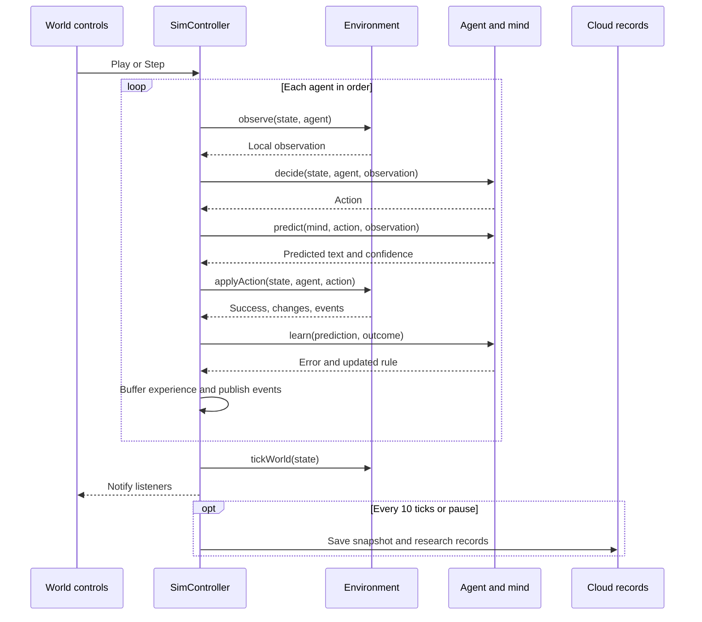
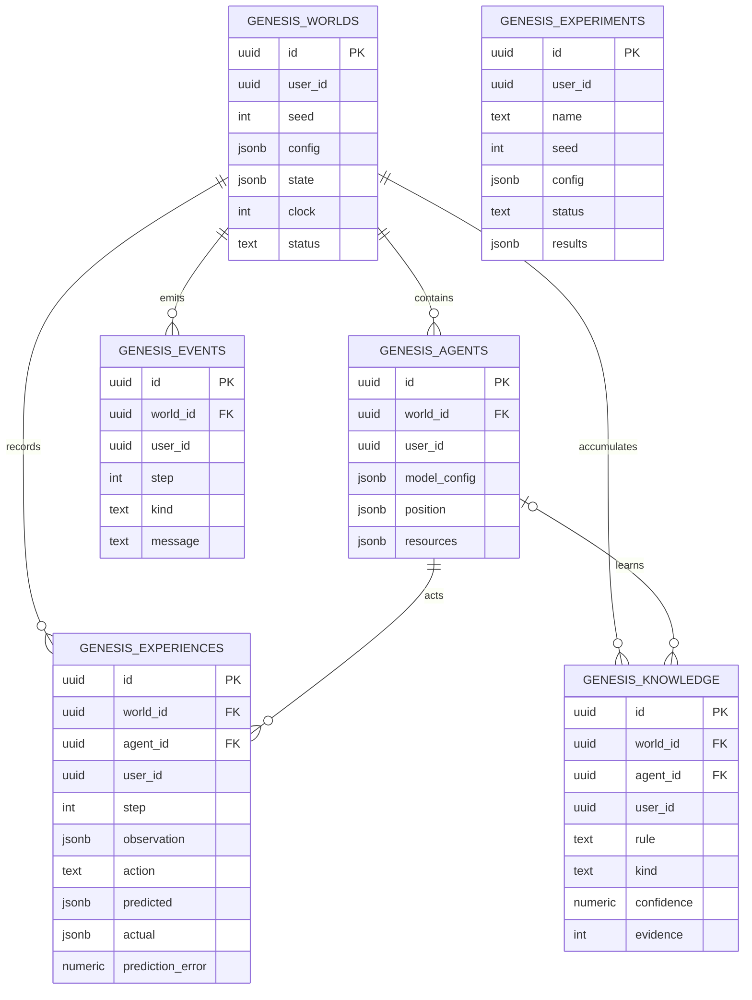

# Genesis system architecture

[Back to README](../README.md)

This describes the implemented symbolic simulation, not a proposed LLM architecture.

## Runtime and modules

| Layer | Source | Responsibility |
| --- | --- | --- |
| Shell/routing | `src/routes/__root.tsx`, `src/router.tsx` | TanStack routing, query provider, document shell, errors |
| Account gate | `src/routes/_authenticated.tsx`, `src/hooks/useAuth.ts` | Client-side session check; database policies enforce access |
| Research pages | `src/routes/_authenticated.*.tsx` | Controls, inspection, experiments, analytics, exports |
| Rendering | `src/components/WorldCanvas.tsx` | Terrain/resources/agents, zoom/pan, click inspection |
| Environment | `src/lib/genesis/world.ts` | Generation, observations, transitions, energy/resources, clock |
| Agent | `src/lib/genesis/agent.ts` | Heuristic decisions, prediction lookup, evidence updates |
| Orchestration | `src/lib/genesis/controller.ts` | Agent ticks, timer, buffers, persistence, offline runs |
| Lifecycle | `src/lib/genesis/session.ts` | In-tab singleton, latest snapshot restore, fresh worlds |
| Queries | `src/lib/genesis/queries.ts` | Authenticated research reads |
| Schema | `drizzle/migrations/0001_genesis_tables.sql` | Six Genesis tables, grants, per-user policies |

Simulation and ordinary research CRUD execute in the browser. There is no Python worker, dedicated simulation server, model service, or job queue. The application uses TanStack Start with the generated hosting adapter; Lovable Cloud manages auth and PostgreSQL records.

## Tick sequence

Agents act sequentially; later agents may see earlier agents' changes in the same tick. Clock advancement happens after all agents act. Play uses a browser interval; speed changes restart it. Pause asynchronously flushes. Closing the tab stops execution.

## State, observations, and priors

World state holds tiles, agents, configuration, clock, and counters. Each agent holds position, inventory, energy, objective, visited tiles, and symbolic rules. Defaults: 26 × 18 tiles, seed 7, three agents, 40-tick day length.

`observe()` returns a radius-two local view, position, inventory, energy, phase, and nearby agents. It omits `TRUE_RULES` and other minds. However:

- Ground truth and transitions ship client-side and can be inspected by the account holder.
- `decide()` receives full world state; observation isolation is a convention, not an enforced capability sandbox.
- The baseline embeds survival/resource priorities, movement priors, and `experiment:wood+stone`.

Successful recipe outcomes enter learned memory, but candidate selection is guided. Do not interpret this as arbitrary recipe invention without prior knowledge.

## Learning and metric meaning

Rules are keyed by action and tile context. New hypotheses start with confidence 0.35 and zero evidence. Success adds evidence and raises confidence by 0.2, capped at 0.99. At least three evidence items and confidence ≥ 0.75 can confirm a rule. Failure lowers confidence by 0.25, floored at 0.05; confidence ≤ 0.15 can label it incorrect. These are heuristic thresholds, not calibrated probabilities.

Error is binary text matching combined with action success—not comparison of full structured next states. Depleted resources and changing context can yield contradictory confidence labels. Ground-truth discovery markers also rely on text matching, not an independent evaluator.

| Metric | Actual definition |
| --- | --- |
| Total rules | Sum across agents; duplicates across agents count separately |
| Confirmed | Rule records currently labeled confirmed |
| Experiment accuracy | Percent of at most 300 recent agent-action records with zero error |
| Coverage | Average per-agent visited-tile percentage |
| Exchanges/gathered/crafted | Accumulated world counters |
| Experiment discoveries | Discovery-kind events still in the at-most-200 event buffer |

Live prediction plots are cumulative within the recent-action buffer, not full-run accuracy histories. Displayed values are measured simulation outputs, but their interpretation is limited by these definitions.

## Data model

Experiments are independent summaries with no live-world foreign key; they also store hypothesis, notes, and timestamps. Knowledge is unique by `(agent_id, rule)` and has a nullable agent reference. Child world/agent relationships cascade on deletion. User ownership fields are plain UUIDs, not account foreign keys.

## Persistence lifecycle

### Live worlds

Creation inserts a world snapshot, then agents. Events insert as emitted. Every ten ticks or on pause, flush writes the snapshot, buffered experiences, upserted rules, and agent positions/resources in separate requests. Stored experience observations contain position, energy, inventory, and phase—not the whole tile view.

Reload restores the latest snapshot, paused; it does not reconstruct recent in-memory action/event buffers. Database queries can still inspect persisted research records. Reset deletes live-world experiences, rules, events, and agents before creating replacements. Export before resetting if history matters.

### Experiments

The page first saves a running experiment row. `runSim()` creates an isolated controller with no world ID, steps in batches of 25, and yields between batches. No live-world rows are written. Completion saves the summary and timestamp; cancellation is checked between batches. Closing the browser can leave a running row unfinished—there is no background job.

## Trust, concurrency, and durability

All six tables enable row-level security, grant CRUD to authenticated users, and check `auth.uid() = user_id` for access and writes. The page guard is navigation convenience; policies enforce record access. Policies do not certify outcome integrity or independently validate ownership consistency of referenced parent rows.

The client controls results. A modified client can write altered records under its own owner ID. The controller singleton lacks account-change invalidation; reload before switching accounts. Multi-tab runs have no lock and can overwrite snapshots. Flushes are asynchronous, not one transaction, have no in-flight lock, and do not comprehensively surface/retry errors. Abrupt closure can lose unsaved progress.

Terrain randomness is seeded, but agent UUIDs are random and affect policy RNG. Matching seeds therefore do not ensure exact trajectories. Persisted experience records can grow; longer/larger runs need throughput and retention review.

## Future extension points

A real model adapter needs strictly observation-only input, validated actions, and authenticated server-side model calls that keep secrets private. Provider preferences alone are not adapters. Stable RNG identities, structured outcome evaluation, complete-run metric accumulators, engine/access tests, durable execution, transactional persistence, and account lifecycle hardening are prerequisites for stronger research claims. None are claimed as implemented here.
